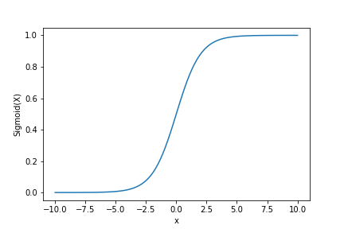
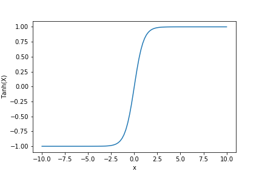
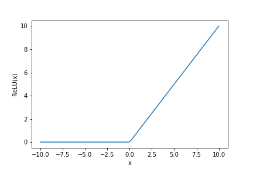
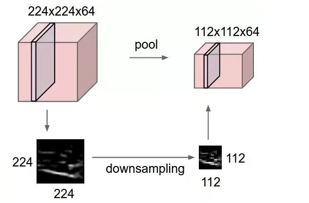
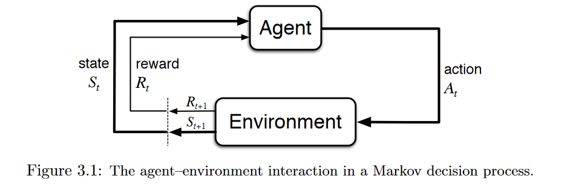
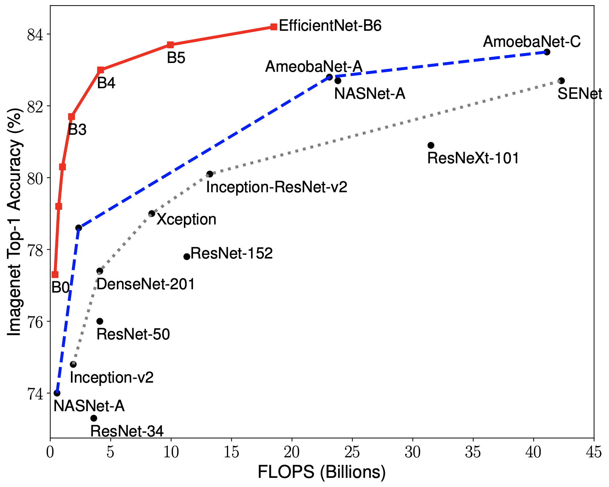

## What is AI / ML?
- What differentiates Artifical Intelegence from Machine Learning?
  - Artificial Intelligence (AI) as an overarching category the encases many other methodologies, disciplines, and practices. AI is anything to do with making machines smart.
  - Machine Learning (ML) is a subset of AI. It refers to a system or machine that can make itself smarter without human interaction. And Deep Learning is a subset of ML.
- What differentiates a Deep Learning model from other Machine Learning models?
  - Number of hidden layers - what is a hidden layer?
- What makes Machine Learning models different from other statistical models, algorithms, or functions?
- What kinds of problems can they solve?
  - Computer vision
    - object detection 
    - classification
  - Natural language processing
    - sentiment analysis
    - chatbots
  - Behavior Prediction
    - Preference Recommendations
    - Inventory Management
  - Diagnosis
    - Medical Diagnosis
    - Vehicle Diagnosis
- What challenges do we face when developing and training AI / ML models?
  - Unexpected biases
    - how can we build trust into the decisions from these black boxes?
    - Are all biases bad? https://www.edge.org/response-detail/25491
  - They can be tricked - adversarial example attacks 
    - https://openai.com/blog/adversarial-example-research/
- Where to go for more information on different models?

## What kinds of ethical, social, or legal issues can arise from the use of AI / ML?

### Papers and Articles
- [Thinking about 'ethics' in the ethics of AI](https://aihub.org/2020/04/16/thinking-about-ethics-in-the-ethics-of-ai/)
- [Papers from the 2017 AAAI Workshop - AI, Ethics, and Society](https://aaai.org/Library/Workshops/ws17-02.php)

### Case Studies
- Facial recognition  
  [Automated Inference on Criminality using Face Images](https://arxiv.org/abs/1611.04135)  
  We are the first to study automated face-induced inference on criminality. By extensive experiments and vigorous cross validations, we have demonstrated that via supervised machine learning, data-driven face classifiers are able to make reliable inference on criminality. Furthermore, we have discovered that a law of normality for faces of noncriminals. After controlled for race, gender and age, the general law-biding public have facial appearances that vary in a significantly lesser degree than criminals.
 
- Resume screening  
  [An overview of ethical issues in using AI systems in hiring with a case study of Amazon’s AI based hiring tool](https://www.researchgate.net/profile/Akhil_Kodiyan/publication/337331539_An_overview_of_ethical_issues_in_using_AI_systems_in_hiring_with_a_case_study_of_Amazon's_AI_based_hiring_tool/links/5dd2aa8d4585156b351d330a/An-overview-of-ethical-issues-in-using-AI-systems-in-hiring-with-a-case-study-of-Amazons-AI-based-hiring-tool.pdf)
   
### What is Fairness?
- [An Intersectional Definition of Fairness](https://arxiv.org/pdf/1807.08362.pdf)
- [AI Fairness 360](https://github.com/ibm/aif360)

### What issues exist around datasets for training ML models?
- Terms of Service
  - Clearview.ai is a company specializing in facial recognition that is scraping images from social media accounts, despite the TOS of those sites disallowing those activities.
- Copyright and Licensing
  - ImageNet is a resource for obtaining labeled images. They have a disclaimer on their download page indicating that they do not own the copyrights of the images within their dataset. 
  - Are models trained on copyrighted digital objects considered a derivative or adaptation of those objects? Does a trained model using copyrighted materials fall under fair use? [A Legal Perspective on Training Models for Natural Language Processing](http://eprints.gla.ac.uk/159231/13/159231.pdf)
- Privacy
  - In typical environments, training data is collected into a central repository. This can pose risks to collected Personally Identifiable Information.
  - [A Federated Learning Framework for Privacy-preserving and Parallel Training](https://arxiv.org/abs/2001.09782)

## Workshop
For this workshop, we are not going to create a machine learning model from scratch. However, we will dive into the parts that make up a deep learning model, with code examples, to hopefully remove some of the mystery behind them. The tool we are using, Keras, provides the flexibility to use commonly used models or to design your own models. In this workshop we will focus on image classification using a convolution neural network. If you are unfamiliar with the term convolution, we will describe it in more detail below.

## Why are we using Keras and Python in this workshop?
Keras' website describes itself as Deep learning for humans. Keras is an API designed for human beings, not machines. Keras follows best practices for reducing cognitive load: it offers consistent & simple APIs, it minimizes the number of user actions required for common use cases, and it provides clear & actionable error messages. It also has extensive documentation and developer guides.

 - Keras is a central port of the tightly-connected TensorFlow 2.0 ecosystem, covering every step of the machine learning workflow.
 - Keras is used by CERN, NASA, NIH, and many more scientific organizations around the world.
 - Keras has the low-level flexibility to implement arbitrary research ideas while offering optional high-level convenience features to speed up experimentation cycles.

Python is currently one of the most used programming languages in the scientific and machine learning development communities. Distributions like Anaconda bundle commonly used libraries and tools, and minimizes the hassle of finding and installing those that are not bundled. It is also the language in which to interact with Keras.

## What makes up a Convolution Neural Network (CNN)?
A CNN is comprised of an input layer, many hidden layers, and an output layer
TODO: add example image
https://medium.com/technologymadeeasy/the-best-explanation-of-convolutional-neural-networks-on-the-internet-fbb8b1ad5df8
### Layers
#### Neurons / Activation Functions
Activation functions are mathematical equations that determine the output of a neural network. The function is attached to each neuron in the network, and determines whether it should be activated (“fired”) or not, based on whether each neuron’s input is relevant for the model’s prediction. Activation functions also help normalize the output of each neuron to a range between 1 and 0 or between -1 and 1. [[2](https://missinglink.ai/guides/neural-network-concepts/7-types-neural-network-activation-functions-right/)]

The activation function is a mathematical “gate” in between the input feeding the current neuron and its output going to the next layer. It can be as simple as a step function that turns the neuron output on and off, depending on a rule or threshold. Or it can be a transformation that maps the input signals into output signals that are needed for the neural network to function. [[2](https://missinglink.ai/guides/neural-network-concepts/7-types-neural-network-activation-functions-right/)]


Common activation functions include:
- Sigmoid outputs are not zero-centered which slows down the learning. [[1](https://doi.org/10.1145/3289402.3289538)]
  ```python
  import matplotlib.pyplot as plt 
  import numpy as np 
  x = np.linspace(-10, 10, 100) 
  z = 1/(1 + np.exp(-x)) 
  
  plt.plot(x, z) 
  plt.xlabel("x") 
  plt.ylabel("Sigmoid(X)") 
  
  plt.show() 
  ```
  
- tanh tends to be expensive to compute and has the same problem as Sigmoid of killing
  the gradients when saturated. The advantage over sigmoid is that it is zero centered. [[1](https://doi.org/10.1145/3289402.3289538)]
  ```python
  import matplotlib.pyplot as plt 
  import numpy as np
  x = np.linspace(-10, 10, 100) 
  z = np.tanh(x)
  
  plt.plot(x, z) 
  plt.xlabel("x") 
  plt.ylabel("Tanh(X)") 
  
  plt.show() 
  ```
  
- Rectified Linear Unit (ReLU) is the most common activation function, it presents many advantages over the
  precedent activation functions. First of all, it is extremely simple to compute, converges
  faster than sigmoid and Tanh and it does not saturate. Besides, it is more biologically
  plausible and closer to biological firing of neurons. [[1](https://doi.org/10.1145/3289402.3289538)]
  ```python
  x = np.linspace(-10, 10, 100) 
  z = np.maximum(0,x)

  plt.plot(x, z) 
  plt.xlabel("x") 
  plt.ylabel("ReLU(X)") 
  
  plt.show()
  ```
  
#### Kernels
- class of algorithms for pattern analysis
- from mathematics, a weighting function for a weighted sum or integral
#### Convolutions
https://towardsdatascience.com/intuitively-understanding-convolutions-for-deep-learning-1f6f42faee1
#### Filters
- concatenation of multiple kernels
#### Pooling
Pooling layers reduce the spatial size of the representation to reduce the amount of parameters and computations in the network.
- Max
- Average

Example of a max pooling function:




## How do we go from zero to a working machine learning model?
### Datasets
Machine learning models are trained against datasets to extract features
- Collect
  - Web scraping
  - API access
  - Research data
  - Online dataset collections
- Validate / Clean
  - Data cleansing tools like Openrefine are good at tabular data
  - Crowdsourcing or human classification, for example CAPTCHA
- Preprocess - Normalize / rescale / augment
  - Why should we preprocess the data?
      - Increase efficiency of our model training
      - For augmenting, artifically increase the amount of data to help prevent over fitting and improve feature detection
  - What could happen if we didn't preprocess our data?
- Segment
  - training
  - testing (evaluation)
  - Why should we segment data?
- Existing datasets
  - MNIST - handwritten digit database
  - CIFAR-10 / CIFAR-100 - are lebeled datasets of color images
  - ImageNet - an image database organized according to the WordNet hierarchy (currently only the nouns)
  - Keras has functionality to pull down a handful of common datasets
    - https://keras.io/api/datasets/
  - For more in depth datasets
    - https://www.tensorflow.org/datasets/catalog/overview
    - To install
      ```bash
      conda install tensorflow-datasets
      ```
### Types of training / learning
- Supervised learning
  - The person provides the input and output patterns for the model to learn
  - Supervised learning is typically done in the context of classification, when we want to map input to output labels, or regression, when we want to map input to a continuous output. Common algorithms in supervised learning include logistic regression, naive bayes, support vector machines, artificial neural networks, and random forests. In both regression and classification, the goal is to find specific relationships or structure in the input data that allow us to effectively produce correct output data. [[5](https://towardsdatascience.com/supervised-vs-unsupervised-learning-14f68e32ea8d)]
- Unsupervised learning
  - The model has to discover features from the input dataset on its own
  - The most common tasks within unsupervised learning are clustering, representation learning, and density estimation. In all of these cases, we wish to learn the inherent structure of our data without using explicitly-provided labels. Some common algorithms include k-means clustering, principal component analysis, and autoencoders. Since no labels are provided, there is no specific way to compare model performance in most unsupervised learning methods. [[5](https://towardsdatascience.com/supervised-vs-unsupervised-learning-14f68e32ea8d)]
- Reinforcement learning (semi-supervised learning)
  - Deals with the type of problems where an agent must learn behavior through trial-and-error interactions with a dynamic environment. [[3](https://doi.org/10.1613/jair.301)]
  
  - Some of the potential applications for this type of machine learning include robotics, chemistry, personalized recommendations, and games. An example is AlphaGO and its derivatives. [[4](https://towardsdatascience.com/applications-of-reinforcement-learning-in-real-world-1a94955bcd12)]
- Transfer learning
  - Utilizes a model trained on one problem is used in some ay on a second related problem [[6](https://machinelearningmastery.com/how-to-use-transfer-learning-when-developing-convolutional-neural-network-models/)]
  - https://keras.io/guides/transfer_learning/

### Model Fitting

### Choosing / building layers for our model
#### What do we want our model to do?
- Classification
- Feature detection

- Keras has the flexibility to allow us to build up the parts of a machine learning model and its layers.
  https://keras.io/examples/vision/image_classification_from_scratch/ (Build a model section)
  ```python
  def make_model(input_shape, num_classes):
    inputs = keras.Input(shape=input_shape)
    # Image augmentation block
    x = data_augmentation(inputs)

    # Entry block
    x = layers.experimental.preprocessing.Rescaling(1.0 / 255)(x)
    x = layers.Conv2D(32, 3, strides=2, padding="same")(x)
    x = layers.BatchNormalization()(x)
    x = layers.Activation("relu")(x)

    x = layers.Conv2D(64, 3, padding="same")(x)
    x = layers.BatchNormalization()(x)
    x = layers.Activation("relu")(x)

    previous_block_activation = x  # Set aside residual

    for size in [128, 256, 512, 728]:
        x = layers.Activation("relu")(x)
        x = layers.SeparableConv2D(size, 3, padding="same")(x)
        x = layers.BatchNormalization()(x)

        x = layers.Activation("relu")(x)
        x = layers.SeparableConv2D(size, 3, padding="same")(x)
        x = layers.BatchNormalization()(x)

        x = layers.MaxPooling2D(3, strides=2, padding="same")(x)

        # Project residual
        residual = layers.Conv2D(size, 1, strides=2, padding="same")(
            previous_block_activation
        )
        x = layers.add([x, residual])  # Add back residual
        previous_block_activation = x  # Set aside next residual

    x = layers.SeparableConv2D(1024, 3, padding="same")(x)
    x = layers.BatchNormalization()(x)
    x = layers.Activation("relu")(x)

    x = layers.GlobalAveragePooling2D()(x)
    if num_classes == 2:
        activation = "sigmoid"
        units = 1
    else:
        activation = "softmax"
        units = num_classes

    x = layers.Dropout(0.5)(x)
    outputs = layers.Dense(units, activation=activation)(x)
    return keras.Model(inputs, outputs)


  model = make_model(input_shape=image_size + (3,), num_classes=2)
  keras.utils.plot_model(model, show_shapes=True)
  ```
- Keras also has common models built-in that we can use:
  https://keras.io/api/applications/
  | Model             | Reference | 
  | -----             | --------- | 
  | Xception          | [Xception: Deep Learning with Depthwise Separable Convolutions ](https://arxiv.org/abs/1610.02357) (CVPR 2017) | 
  | VGG16             | [Very Deep Convolutional Networks for Large-Scale Image Recognition](https://arxiv.org/abs/1409.1556) (ICLR 2015) | 
  | VGG19             | [Very Deep Convolutional Networks for Large-Scale Image Recognition](https://arxiv.org/abs/1409.1556) (ICLR 2015) | 
  | ResNet50          | [Deep Residual Learning for Image Recognition](https://arxiv.org/abs/1512.03385) (CVPR 2015) | 
  | ResNet101         | [Deep Residual Learning for Image Recognition](https://arxiv.org/abs/1512.03385) (CVPR 2015) | 
  | ResNet152         | [Deep Residual Learning for Image Recognition](https://arxiv.org/abs/1512.03385) (CVPR 2015) | 
  | ResNet50V2        | [Identity Mappings in Deep Residual Networks](https://arxiv.org/abs/1603.05027) (CVPR 2016) | 
  | ResNet101V2       | [Identity Mappings in Deep Residual Networks](https://arxiv.org/abs/1603.05027) (CVPR 2016) | 
  | ResNet152V2       | [Identity Mappings in Deep Residual Networks](https://arxiv.org/abs/1603.05027) (CVPR 2016) | 
  | InceptionV3       | [Rethinking the Inception Architecture for Computer Vision](http://arxiv.org/abs/1512.00567) (CVPR 2016) | 
  | InceptionResNetV2 | [Inception-v4, Inception-ResNet and the Impact of Residual Connections on Learning](https://arxiv.org/abs/1602.07261) (AAAI 2017) | 
  | MobileNet         | [MobileNets: Efficient Convolutional Neural Networks for Mobile Vision Applications](https://arxiv.org/abs/1704.04861) | 
  | MobileNetV2       | [MobileNetV2: Inverted Residuals and Linear Bottlenecks](https://arxiv.org/abs/1801.04381) (CVPR 2018) | 
  | DenseNet121       | [Densely Connected Convolutional Networks](https://arxiv.org/abs/1608.06993) (CVPR 2017 Best Paper Award) | 
  | DenseNet169       | [Densely Connected Convolutional Networks](https://arxiv.org/abs/1608.06993) (CVPR 2017 Best Paper Award) | 
  | DenseNet201       | [Densely Connected Convolutional Networks](https://arxiv.org/abs/1608.06993) (CVPR 2017 Best Paper Award) | 
  | NASNetMobile      | [Learning Transferable Architectures for Scalable Image Recognition](https://arxiv.org/abs/1707.07012) | 
  | NASNetLarge       | [Learning Transferable Architectures for Scalable Image Recognition](https://arxiv.org/abs/1707.07012) | 
  | EfficientNetB0    | [EfficientNet: Rethinking Model Scaling for Convolutional Neural Networks](https://arxiv.org/abs/1905.11946) (ICML 2019) | 
  | EfficientNetB1    | [EfficientNet: Rethinking Model Scaling for Convolutional Neural Networks](https://arxiv.org/abs/1905.11946) (ICML 2019) | 
  | EfficientNetB2    | [EfficientNet: Rethinking Model Scaling for Convolutional Neural Networks](https://arxiv.org/abs/1905.11946) (ICML 2019) | 
  | EfficientNetB3    | [EfficientNet: Rethinking Model Scaling for Convolutional Neural Networks](https://arxiv.org/abs/1905.11946) (ICML 2019) | 
  | EfficientNetB4    | [EfficientNet: Rethinking Model Scaling for Convolutional Neural Networks](https://arxiv.org/abs/1905.11946) (ICML 2019) | 
  | EfficientNetB5    | [EfficientNet: Rethinking Model Scaling for Convolutional Neural Networks](https://arxiv.org/abs/1905.11946) (ICML 2019) | 
  | EfficientNetB6    | [EfficientNet: Rethinking Model Scaling for Convolutional Neural Networks](https://arxiv.org/abs/1905.11946) (ICML 2019) | 
  | EfficientNetB7    | [EfficientNet: Rethinking Model Scaling for Convolutional Neural Networks](https://arxiv.org/abs/1905.11946) (ICML 2019) | 

The following graphs show the accuracy of these models. *These were sourced from the [tensorflow github repository](https://github.com/tensorflow/tpu/tree/master/models/official/efficientnet) describing EfficientNet.
<table border="0">
<tr>
    <td>
    
    </td>
    <td>
    
    </td>
</tr>
</table>

#### CNN for Image Classification
We will be using an existing model in Keras along with weightings from ImageNet
```python
from keras.applications.resnet50 import ResNet50
from keras.preprocessing import image
from keras.applications.resnet50 import preprocess_input, decode_predictions
import numpy as np

model = ResNet50(weights='imagenet')

img_path = 'figures/chili-dog-horiz-a-1600.jpg'
img = image.load_img(img_path, target_size=(224, 224))
x = image.img_to_array(img)
x = np.expand_dims(x, axis=0)
x = preprocess_input(x)

preds = model.predict(x)
# decode the results into a list of tuples (class, description, probability)
# (one such list for each sample in the batch)
print('Predicted:', decode_predictions(preds, top=3))
```
Result:
```
Predicted: [[('n07697537', 'hotdog', 0.9996661), ('n07873807', 'pizza', 0.00024167488), ('n07697313', 'cheeseburger', 4.342605e-05)]]
```

This model did a decent job at detecting that we had a hot dog with 99.9% probability, but it did not recognize that it also belonged to the subgroup chili dog. Why didn't it recognize this subgroup? How can we improve this model to distinguish a chili dog from other types of hotdogs?

#### Retrain our Image Classification Model to Recognize Chili Dogs
- Obtain dataset of chili dogs for training and testing. Create the directory structure "data/images/chilidog/" and run the following code to obtain a raw dataset.
  ```python
  chilidog_urls = "http://image-net.org/api/text/imagenet.synset.geturls?wnid=n07865105"

  for i, image_url in enumerate(requests.get(chilidog_urls).iter_lines()):
      if image_url:
          try:
              image_request = requests.get(image_url, timeout=3)
          except requests.exceptions.SSLError:
              print("SSL Error - moving on")
              continue
          except requests.exceptions.Timeout:
              print("Timeout - moving on")
              continue
          except requests.exceptions.ConnectionError:
              print("Connection Error - moving on")
              continue
          if image_request.status_code == requests.codes.ok:
              if "image" in image_request.headers['content-type']:
                  with open(f"data/images/chilidog/{i}", "wb") as f:
                      f.write(image_request.content)
                      print(f"Saved {image_url}")
  ```
  The above code returns images that have a lot of noise, inconsistencies, and errors - some are not, in fact, chili dogs. For example, those of you familiar with Chicago style hotdogs will recognize the following image. There is no chili on those hotdogs! Can you see any other issues with this image?  
  

  The web scraping code results in raw data that still needs to be cleaned. After manually cleaning, we can leverage Keras to augment these to generate additional images for our dataset.

- Why would we apply Transfer Learning to a pre-trained model over starting from scratch?
  https://keras.io/guides/transfer_learning/

The following is an example workflow outlined in Keras' documentation:
1. Instantiate a base model and load pre-trained weights into it.
2. Freeze all layers in the base model by setting trainable = False.
3. Create a new model on top of the output of one (or several) layers from the base model.
4. Train your new model on your new dataset.

TODO: Add code examples for preprocessing image dataset and retraining ResNet weightings

## Aditional information and examples
- https://keras.io/examples/


# References
1. "Deep Learning: An Overview" - https://doi.org/10.1145/3289402.3289538
2. "7 Types of Neural Network Activation Functions: How to Choose?" - https://missinglink.ai/guides/neural-network-concepts/7-types-neural-network-activation-functions-right/
3. "Reinforcement Learning: A Survey" - https://doi.org/10.1613/jair.301
4. "Applications of Reinforcement Learning in Real World" - https://towardsdatascience.com/applications-of-reinforcement-learning-in-real-world-1a94955bcd12
5. "Supervised vs. Unsupervised Learning" - https://towardsdatascience.com/supervised-vs-unsupervised-learning-14f68e32ea8d
6. "Transfer Learning in Keras with Computer Vision Models" - https://machinelearningmastery.com/how-to-use-transfer-learning-when-developing-convolutional-neural-network-models/